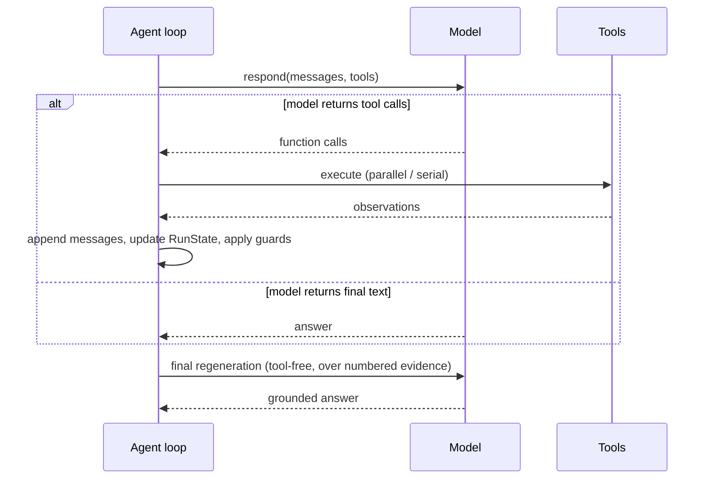
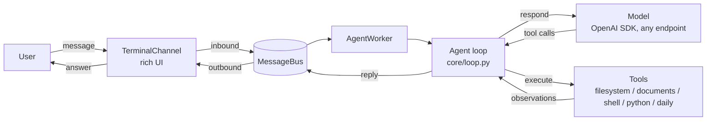
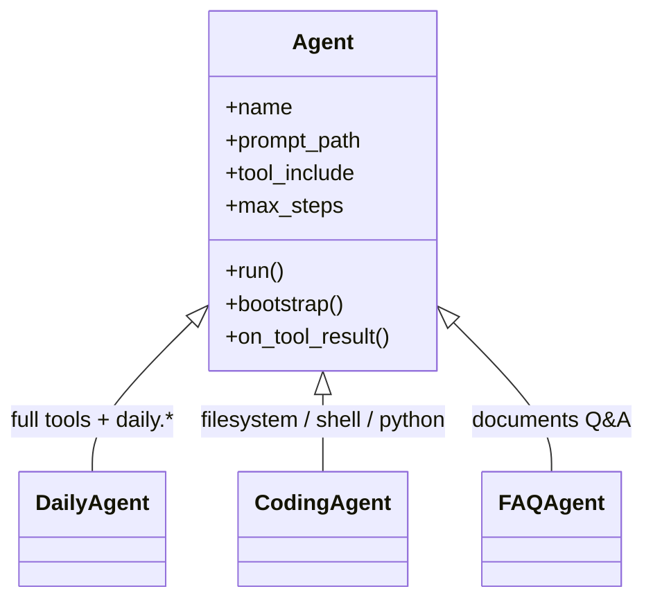

# Minimal Codex-Style Agent Runtime

**English** · [简体中文](./README.zh-CN.md)

*Also known as: `thin-harness`* — from the design principle "thin harness"

thin-harness is a small, general-purpose Python framework for building your
own agent: **you define the agent and tools, it runs the loop.**

- **Your agents.** Subclass `Agent`; pick the prompt, tools, and limits —
  behavior stays under your control. No YAML.
- **Your tools.** A typed Python function with `@tool`; auto-discovered.
- **Your model.** Four values in `.env`, any OpenAI-compatible endpoint.

A document FAQ, a coding helper, or a daily assistant all run on the same
framework — only your agent and tools change. Not a knowledge-base assistant,
and no planners, critics, or multi-agent orchestration.

## Who this is for

- **Developers who want to read and own their agent loop** — the whole
  runtime is a handful of files; change whatever you need.
- **Anyone who wants a local, terminal-based general assistant** that chats
  normally and can also inspect files, read documents, run commands, or write
  code — with one `.env` pointing at any OpenAI-compatible endpoint.
- **People building a small domain agent** (document FAQ, a coding helper, a
  daily assistant): define it as a Python subclass, add tools as decorated
  functions, and you are done.
- **Learners** — a compact, readable reference for how a Codex-style agent
  loop, tool calling, and memory can be built.

Not aimed at teams that need a managed RAG/knowledge-base product,
large-scale multi-agent orchestration, or a full plugin ecosystem.

## References

- [OpenAI Codex](https://github.com/openai/codex) — the agent loop design:
  model -> tools -> observations, append-only context, deterministic guards.
- [nanobot](https://github.com/chrishayuk/nanobot) — the terminal chat shape:
  rich rendering plus a simple async message bus.

Both are design references only; no code is copied or imported.

## Extensible by design

| To extend...      | How                                                     | Example                                  |
| ----------------- | ------------------------------------------------------- | ---------------------------------------- |
| a new tool        | a typed function + `@tool` in `tools/`                  | `@tool def read_file(path, max_chars=...)` |
| a domain agent    | subclass `Agent`, declare prompt / tools / limits       | `class MyAgent(Agent)`                    |
| a new model       | edit `.env` (`LLM_BASE_URL` + `LLM_MODEL`)              | DeepSeek -> DashScope -> LiteLLM          |
| runtime behavior  | override hooks (`bootstrap`, `on_tool_result`)          | FAQ document pre-search                   |

## Core design

- **One loop.** `Model -> Tool calls -> Environment -> observations -> Model`,
  with deterministic guards only (step/tool budgets, timeouts, no-gain
  cutoff, duplicate-call handling). No hidden reasoning or reflection calls.
- **Append-only context.** Message history is append-only, so the prompt
  prefix stays byte-stable for provider prefix caching. Recent conversation
  turns are kept verbatim so references like "that document" resolve; older
  turns are clipped.
- **Structured world state.** Observations, facts, and artifacts live in a
  `RunState`, not in an ever-growing raw message list.
- **Grounded final pass.** After tools are used, one tool-free call
  regenerates the answer over numbered evidence (`AUTHORIZED EVIDENCE`).
  Citations are advisory, not a mandatory knowledge-base contract: general
  questions answer from the model's own knowledge and never refuse just
  because no file matched.
- **Read-only cache reuse.** Exact repeated calls to read-only tools return
  the previous result (marked `Reused previous result`) instead of
  re-executing or erroring; non-cacheable duplicates are blocked.
- **Tools are typed Python functions.** Auto-discovered from `tools/`, schema
  generated from type hints and docstrings, no central registration file.
- **Agents are Python subclasses.** No YAML. An agent declares prompt, tool
  selection, and limits; the model always comes from `.env`.

### The loop in sequence



## Architecture

```text
core/
  agent.py     Agent = Model + System Prompt + Selected Tools + Harness Policy
  loop.py      Core loop + deterministic guards; cache reuse; final pass
  model.py     Model interface + OpenAIModel (OpenAI SDK, any compatible
               base_url) + ScriptedModel/EchoModel (offline)
  providers.py Generic .env (key/base_url/model/thinking) -> OpenAI SDK
  context.py   Append-only ContextBuilder: base messages + incremental appends
  tool.py      @tool decorator, schema generation, execution/normalization
  types.py     RunState, Observation, Fact, Evidence, Artifact, ToolResult...
  artifacts.py Artifact store for large tool outputs
  storage.py   SQLite memory via peewee (Session/Turn/Fact/Artifact/DebugEvent)

tools/         Auto-discovered shared tools (each module = a namespace)
  filesystem.py  read (windowed: offset/next_offset), write, list, find, grep
  shell.py / python.py   subprocess execution
  artifacts.py  artifacts.read
  documents.py  documents.list/read/search/progress (pdf/docx/txt/...)
  daily.py      daily.now (local time), daily.todo (local todo list)

agents/        Domain subclasses, no YAML
  daily_agent.py  DailyAgent (default): full tool set + daily.* helpers
  coding_agent.py CodingAgent: filesystem/shell/python focus
  faq_agent.py    FAQAgent: document Q&A (documents.* + targeted filesystem)
prompts/agent.md  Generic agent instructions (shared; "decide first, then act")
chat/          Terminal chat: rich channel + simple async message bus
  bus.py / worker.py / channel.py
tests/         Unit + end-to-end tests (123, all green)
examples/mock_run.py
```

### Runtime flow



## Quick start

```bash
pip install -r requirements.txt
cp .env.example .env    # fill in LLM_API_KEY / LLM_BASE_URL
python -m chat          # default: daily agent, terminal chat
```

As a library:

```python
from agents import create_agent

agent = create_agent()  # DailyAgent by default
result = await agent.run("Check the git status of this project.")
print(result.text)
```

Offline demo (no API key):

```bash
python -m chat --demo
python examples/mock_run.py
```

## Agents

An agent is a Python subclass of `core.agent.Agent` — not a YAML file. It only
defines the domain: `prompt` / `prompt_path`, `tool_include` /
`tool_exclude`, `own_tools`, and runtime limits. The model is constructed
from `.env` by the provider layer, so an agent never configures a model:

```python
from core.agent import Agent
from core.tool import agent_tool


@agent_tool
def hello(name: str) -> str:
    """Say hello to someone."""
    return f"hello {name}"


class MyAgent(Agent):
    name = "my-agent"
    prompt = "You are a friendly assistant."
    own_tools = [hello]   # private to this agent only


agent = MyAgent()
result = await agent.run("say hello to codex")
print(result.text)
```

`@agent_tool` makes a tool private to one agent; shared tools go in `tools/`
with `@tool` (see below).

Built-in agents (pick with `--agent`, default `daily`):

- `daily` — full shared tool set (`filesystem.*`, `shell.run`, `python.run`,
  `documents.*`, `artifacts.read`, `daily.now`, `daily.todo`), for everyday
  local work.
- `coding` — filesystem/shell/python focus for code tasks.
- `faq` — answers questions from documents: finds them with `documents.list`,
  reads them in character windows (default 200, max 6000) via
  `documents.read` (offset/next_offset continuation), locates keywords with
  `documents.search`, tracks coverage with `documents.progress`, and cites
  the source. Supported formats: PDF, DOCX, and common text files.

### Agent hierarchy



## Model config (.env — no vendor catalog)

`.env` holds exactly four values:

```env
LLM_API_KEY=
LLM_BASE_URL=https://api.deepseek.com
LLM_MODEL=deepseek-chat
LLM_ENABLE_THINKING=false
```

The provider layer resolves them and talks to any OpenAI-compatible endpoint
(DeepSeek, Alibaba DashScope, LiteLLM proxy, ...) through the OpenAI SDK.
Resolution order per field: explicit config -> env var -> default. Switching
models is editing `.env`, nothing else.

Note: `LLM_ENABLE_THINKING` is passed through for endpoints that support it;
on DeepSeek, thinking is controlled by the model choice (`deepseek-chat` vs a
reasoner variant).

## Terminal chat

```bash
python -m chat                      # daily agent
python -m chat --agent faq          # document Q&A
python -m chat --demo               # offline echo
python -m chat --progress           # per-step progress lines + live timer
python -m chat --debug 1|2|3        # leveled runtime debug
python -m chat --session work       # memory session (persists across restarts)
python -m chat --db data/other.db   # custom SQLite path
python -m chat --markdown           # full live Markdown (ANSI terminal)
```

In-chat commands: `/help`, `/clear` (wipe session memory), `/tools` (list the
current agent's tools with purposes), `/exit`. `Ctrl+C` quits cleanly;
`Shift+Enter` inserts a newline so a message can span several lines.

Answers stream token by token and are rendered as Markdown line by line (no
redraws, works on any terminal). By default the UI stays quiet: only
`agent is working…` and the final `[t=…] N steps · M tool calls` summary
appear. With `--progress`, each step prints with a running `[t=…]` timestamp
and a live in-place timer during model calls. Debug events flow through the
same bus and never pollute the model context.

## Memory & persistence (SQLite + peewee)

Codex-style memory in `core/storage.py` (default `data/agent.db`):

- `Session` — one row per chat session;
- `Turn` — every run (request, response, stop reason, counters);
- `Fact` — verified facts, session-scoped or global (`Memory.remember`);
- `Artifact` — full tool outputs, survive the run;
- `DebugEvent` — structured per-run debug records, persisted regardless of
  UI debug level (inspect with `Memory.load_debug(run_id)`).

The loop loads prior turns and facts into context at run start (recent turns
verbatim, older clipped) and saves the run at the end. Restart `python -m
chat` with the same `--session` and it remembers the conversation.

## Adding a tool

Tools are the primary extension surface. The runtime discovers them
automatically and generates their schemas from type hints, defaults, and
docstrings — there is no central registration file to edit.

Create a file under `tools/` and decorate a typed function:

```python
from core.tool import tool


@tool
def read_file(path: str, max_chars: int = 1000) -> str:
    """Read a text file."""
    ...
```

The tool name is `<module>.<function>`, the schema is generated from type
hints/defaults/docstrings, and no central registration file needs editing.
Registry names keep dot namespaces (`filesystem.read`); the loop maps them to
API-safe names (`filesystem_read`) for the model and back before executing.
Tools may declare `ctx: ToolContext` to access the artifact store, workdir,
request, or `ctx.record_fact(...)`. `@tool(serial=True)` forces a tool to run
alone; `@tool(cacheable=True)` lets exact repeats reuse the previous result.
`@agent_tool` defines tools private to one agent (`own_tools`).

Agents can also override behavior hooks: `on_run_start`, `bootstrap` (cheap
pre-model work, e.g. the FAQ pre-search), and `on_tool_result`.

## Loop guards (deterministic only)

- `max_steps` / `max_tool_calls` — model and tool budgets;
- `tool_timeout` / `model_timeout` / `request_timeout` — time budgets;
- repeated calls — cacheable tools reuse the result (`cached` observation);
  others are `blocked` with a hint to change arguments or continue via
  `next_offset`;
- `max_consecutive_no_gain` — N rounds with no new evidence force the final
  pass;
- `max_consecutive_failures` — stop a run that keeps failing;
- `final_regenerate` — one tool-free pass over numbered evidence after tools
  were used;
- `token_budget_tokens` (ContextConfig) — when set, exceeding the estimated
  budget (bytes/4) injects a stop hint; per-call timings include TTFT
  (`connect_ms` / `ttft_ms` in debug).

No scoring systems, reflection calls, planners, or intent classifiers.

## Tests

```bash
python -m unittest discover -s tests -t . -v
```

123 tests covering tools/schema, the loop (guards, cache reuse, evidence
final pass), context building, agents, memory, document window reading, and
the terminal chat (bus, worker, rendering, input commands).

## Security notes

- `shell.run` and `python.run` execute with the current user's privileges —
  local development tools, not sandboxes.
- Filesystem tools enforce read/write size limits and UTF-8 handling, but do
  not jail the agent to a directory.

## Deliberate omissions / extension points

- No skills, workflows, DAGs, planner/critic agents, multi-agent
  orchestration, semantic routing, or embedding-based tool selection.
- Artifacts are in-memory per run (disk persistence is a future extension).
- Fact extraction is explicit only (`ctx.record_fact`); no automatic critic.
- History compaction is deferred: recent turns are verbatim, older ones are
  clipped, and the token budget is estimated — full summarization compaction
  is the documented next step for very long sessions.

## License

MIT — see [LICENSE](LICENSE).
