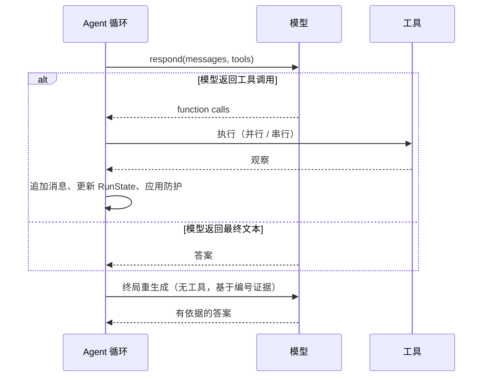
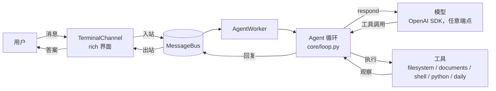
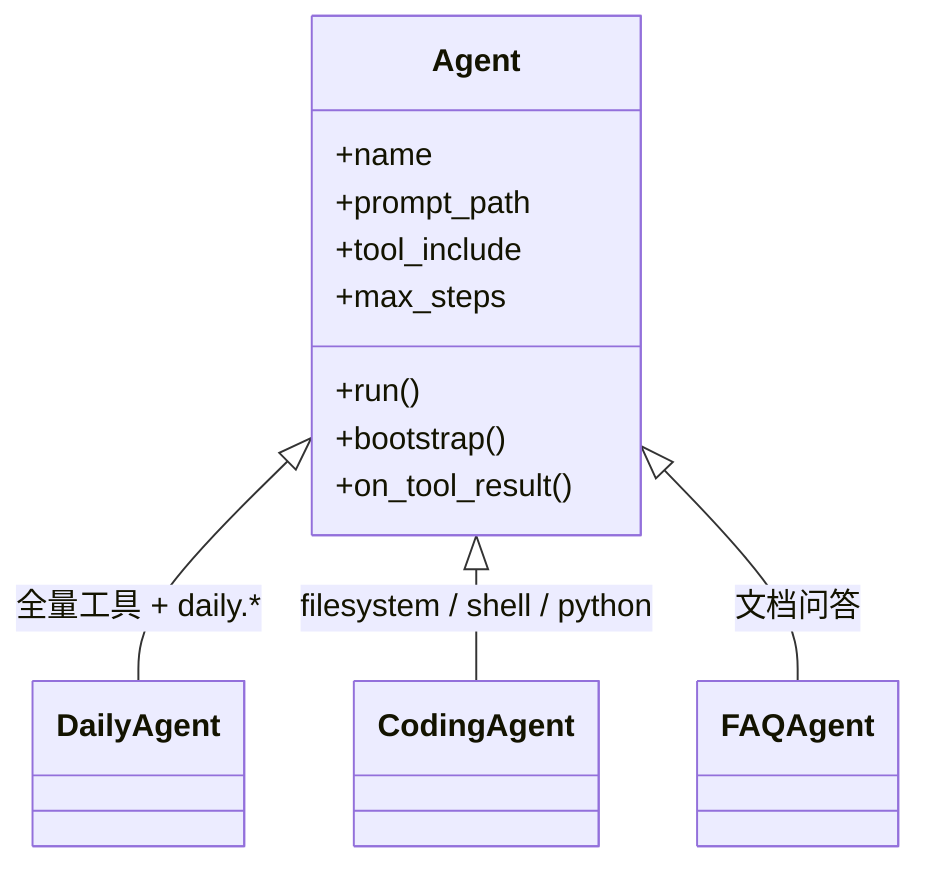

# 极简 Codex 风格 Agent 运行时（Minimal Codex-Style Agent Runtime）

[English](./README.md) · **简体中文**

*别名：`thin-harness`* —— 取自设计理念 "thin harness"（轻薄外壳）

thin-harness 是一个小巧、通用的 Python 框架，用来构建你自己的 Agent：
**Agent 和工具由你定义，框架负责跑起来。**

- **你的 Agent。** 继承 `Agent`，自定提示词、工具和上限；行为可控，不用
  YAML。
- **你的工具。** 一个带类型注解的 Python 函数加 `@tool`，自动被发现。
- **你的模型。** `.env` 四个值，任意 OpenAI 兼容端点。

文档问答、编码助手、日常助手都跑在同一个框架上——变的只是你的 Agent 和
工具。它不是知识库助手，也没有 planner、critic、多 Agent 编排。

## 面向对象

- **想读懂并掌控 agent 主循环的开发者**——整个运行时就是几个文件，想改直接改。
- **想要一个本地、终端化通用助手的人**——既能正常聊天，也能查文件、读文档、
  跑命令、写代码；一个 `.env` 指向任意 OpenAI 兼容端点即可。
- **想快速搭一个领域小 agent 的人**（文档 FAQ、编码助手、日常助手）——定义
  成 Python 子类，工具写成装饰函数，就完成了。
- **学习者**——这是一个紧凑、可读的 Codex 风格 agent 循环、工具调用与记忆
  的参考实现。

不适合：需要托管式 RAG/知识库产品、大规模多 Agent 编排，或完整插件生态
框架的团队。

## 参考项目

- [OpenAI Codex](https://github.com/openai/codex) —— agent 循环设计：
  模型 -> 工具 -> 观察、追加式上下文、确定性防护。
- [nanobot](https://github.com/chrishayuk/nanobot) —— 终端聊天形态：
  rich 渲染 + 简单异步消息队列。

两者仅作为设计参考，未复制或导入任何代码。

## 可扩展设计

| 想扩展什么       | 怎么做                                        | 示例                                        |
| ---------------- | --------------------------------------------- | ------------------------------------------- |
| 一个新工具       | `tools/` 下写一个带类型注解的函数 + `@tool`    | `@tool def read_file(path, max_chars=...)`   |
| 一个领域 Agent   | 继承 `Agent`，声明 prompt / tools / 上限      | `class MyAgent(Agent)`                       |
| 一个新的模型     | 改 `.env`（`LLM_BASE_URL` + `LLM_MODEL`）     | DeepSeek -> DashScope -> LiteLLM             |
| 运行时行为       | 覆写钩子（`bootstrap`、`on_tool_result`）     | FAQ 文档预检索                               |

## 核心设计

- **一条主循环。** `模型 -> 工具调用 -> 环境 -> 观察 -> 模型`，只有确定性
  防护（步骤/工具预算、超时、无进展截断、重复调用处理）。没有隐藏推理、
  没有反思调用。
- **追加式上下文。** 消息历史只追加，prompt 前缀保持字节稳定，利于厂商前缀
  缓存。最近的对话轮次全文保留（指代如"那个文档"可消解），更早的轮次裁剪。
- **结构化世界状态。** 观察、事实、artifact 放在 `RunState` 里，而不是一条
  无限增长的原始消息列表。
- **有依据的终局重生成。** 使用过工具后，用一次无工具调用在编号证据
  （`AUTHORIZED EVIDENCE`）之上重新生成答案。引用是建议性的，不是知识库式
  的强制契约：通用问题用模型自身知识回答，绝不因为"没有文件匹配"就拒绝。
- **只读工具缓存复用。** 只读工具的精确重复调用直接返回上次结果（标记
  `Reused previous result`），不重复执行也不报错；非 cacheable 的重复调用
  会被阻止。
- **工具就是带类型注解的 Python 函数。** 从 `tools/` 自动发现，schema 由
  类型注解和 docstring 自动生成，无需中心注册文件。
- **Agent 是 Python 子类。** 不用 YAML。Agent 只声明提示词、工具选择和运行
  上限；模型一律来自 `.env`。

### 主循环时序



## 架构

```text
core/
  agent.py     Agent = 模型 + 系统提示词 + 选定工具 + 运行策略
  loop.py      主循环 + 确定性防护；缓存复用；终局重生成
  model.py     模型接口 + OpenAIModel（OpenAI SDK，任意兼容 base_url）
               + ScriptedModel/EchoModel（离线）
  providers.py 通用 .env（key/base_url/model/thinking）-> OpenAI SDK
  context.py   追加式 ContextBuilder：基础消息 + 增量追加
  tool.py      @tool 装饰器、schema 生成、执行/结果归一化
  types.py     RunState、Observation、Fact、Evidence、Artifact、ToolResult...
  artifacts.py 大工具输出的 artifact 存储
  storage.py   基于 peewee 的 SQLite 记忆
               （Session/Turn/Fact/Artifact/DebugEvent）

tools/         自动发现的共享工具（每个模块一个命名空间）
  filesystem.py  read（窗口化：offset/next_offset）、write、list、find、grep
  shell.py / python.py  子进程执行
  artifacts.py  artifacts.read
  documents.py  documents.list/read/search/progress（pdf/docx/txt/...）
  daily.py      daily.now（本地时间）、daily.todo（本地待办清单）

agents/        领域子类，不用 YAML
  daily_agent.py  DailyAgent（默认）：全量工具 + daily.* 日常工具
  coding_agent.py CodingAgent：文件系统/shell/python 专注
  faq_agent.py    FAQAgent：文档问答（documents.* + 定向 filesystem）
prompts/agent.md  通用 Agent 指令（共享；"先判断，再行动"）
chat/          终端聊天：rich 渲染通道 + 简单异步消息总线
  bus.py / worker.py / channel.py
tests/         单元 + 端到端测试（123 个，全部通过）
examples/mock_run.py
```

### 运行时数据流



## 快速开始

```bash
pip install -r requirements.txt
cp .env.example .env    # 填入 LLM_API_KEY / LLM_BASE_URL
python -m chat          # 默认：daily agent，终端聊天
```

作为库使用：

```python
from agents import create_agent

agent = create_agent()  # 默认 DailyAgent
result = await agent.run("Check the git status of this project.")
print(result.text)
```

离线演示（无需 API key）：

```bash
python -m chat --demo
python examples/mock_run.py
```

## Agent

Agent 是 `core.agent.Agent` 的 Python 子类——不是 YAML 文件。它只定义领域：
`prompt` / `prompt_path`、`tool_include` / `tool_exclude`、`own_tools` 和
运行上限。模型由 provider 层从 `.env` 构建，因此 Agent 从不配置模型：

```python
from core.agent import Agent
from core.tool import agent_tool


@agent_tool
def hello(name: str) -> str:
    """Say hello to someone."""
    return f"hello {name}"


class MyAgent(Agent):
    name = "my-agent"
    prompt = "You are a friendly assistant."
    own_tools = [hello]   # 只属于这个 Agent 的私有工具


agent = MyAgent()
result = await agent.run("say hello to codex")
print(result.text)
```

`@agent_tool` 定义只属于某个 Agent 的私有工具；共享工具用 `@tool` 写在
`tools/` 下（见下文）。

内置 Agent（用 `--agent` 选择，默认 `daily`）：

- `daily` — 全量共享工具（`filesystem.*`、`shell.run`、`python.run`、
  `documents.*`、`artifacts.read`、`daily.now`、`daily.todo`），面向日常本地
  工作。
- `coding` — 文件系统/shell/python 专注，面向编码任务。
- `faq` — 从文档回答问题：用 `documents.list` 找文档，用 `documents.read`
  按字符窗口读取（默认 200，最大 6000，offset/next_offset 续读），用
  `documents.search` 定位关键词，用 `documents.progress` 跟踪已读覆盖，
  回答标注来源。支持 PDF、DOCX 及常见文本文件。

### Agent 继承关系



## 模型配置（.env —— 无厂商目录）

`.env` 只放四个值：

```env
LLM_API_KEY=
LLM_BASE_URL=https://api.deepseek.com
LLM_MODEL=deepseek-chat
LLM_ENABLE_THINKING=false
```

provider 层自行解析，并通过 OpenAI SDK 与任意 OpenAI 兼容端点（DeepSeek、
阿里云 DashScope、LiteLLM proxy 等）通信。每个字段的解析顺序：显式配置 ->
环境变量 -> 默认值。切换模型只需编辑 `.env`，无需改动任何代码。

注意：`LLM_ENABLE_THINKING` 只对支持它的端点生效；在 DeepSeek 上 thinking
由模型选择控制（`deepseek-chat` 与 reasoner 变体）。

## 终端聊天

```bash
python -m chat                      # daily agent
python -m chat --agent faq          # 文档问答
python -m chat --demo               # 离线 echo
python -m chat --progress           # 分步进度行 + 实时计时
python -m chat --debug 1|2|3        # 分级运行时调试
python -m chat --session work       # 记忆会话（重启后保留）
python -m chat --db data/other.db   # 自定义 SQLite 路径
python -m chat --markdown           # 完整实时 Markdown（ANSI 终端）
```

聊天内命令：`/help`、`/clear`（清空会话记忆）、`/tools`（列出当前 Agent 的
工具及用途）、`/exit`。`Ctrl+C` 干净退出；`Shift+Enter` 插入换行，消息可
多行。

回答逐 token 流式输出，按 Markdown 逐行渲染（不重绘，任何终端可用）。默认
界面保持安静：只显示 `agent is working…` 和最终的
`[t=…] N steps · M tool calls` 汇总。加 `--progress` 后，每一步带累计
`[t=…]` 时间戳打印，模型调用期间有原地实时计时。调试事件走同一总线，绝不
污染模型上下文。

## 记忆与持久化（SQLite + peewee）

Codex 风格记忆在 `core/storage.py`（默认 `data/agent.db`）：

- `Session` —— 每个聊天会话一行；
- `Turn` —— 每次运行（请求、响应、停止原因、计数器）；
- `Fact` —— 经验证的事实，会话级或全局（`Memory.remember`）；
- `Artifact` —— 完整工具输出，运行结束后仍保留；
- `Experience` —— “进化”记忆：每条经验是一个 JSON 文档
  （`problem_type`、`keywords`、`method`、`result`、`success`），按规范化
  请求或“相同问题类型 + ≥2 个共享关键词”去重更新，按使用次数排序，启动时
  自动合并存量重复，并带时间维度：`learned_at` / `last_used_at` /
  `time_sensitive`，时效敏感的经验超过 `experience_stale_days`（默认 7 天）
  未再使用就不再注入，直到重新验证；
- `DebugEvent` —— 每次运行的结构化调试记录，与 UI 调试级别无关始终落库
  （用 `Memory.load_debug(run_id)` 查看）。

经验模块按 Agent 单独配置：在 `Agent` 子类上设 `experience_enabled = False`
即可同时关闭“注入经验”和“运行后沉淀”（例如 `FAQAgent` 已关闭，文档问答
不需要历史捷径）。

经验支持原地更新：同一任务换个说法再问，会合并进原记录而不是新建；
`daily.update` 可直接在聊天里编辑某条经验（改方法、换关键词、标记为失败），
`daily.forget` 负责删除。

每次运行都带时间：上下文头部固定注入 `CURRENT TIME`（本地时钟 + 时区），
反思沉淀时也会让模型标注该方法是否时效敏感——agent 不用调工具就知道“今天”，
过期的天气/新闻类旧方法会自动沉底，直到被重新验证。

Agent 自身也持有时间状态：每个 `Agent` 实例暴露 `started_at`、
`last_run_at` 和 `now()` 供钩子/工具使用；当会话已存在时，上下文头部还会
显示 `SESSION STATE`（会话开始时间、上次活跃时间，以及人性化的“X 前”），
跨天恢复对话时 agent 不会再搞不清自己的时间线。

环境感知：上下文头部还有 `ENVIRONMENT` 段（操作系统 + 版本/架构、Python
版本、检测到的终端、shell、用户、工作目录），同时挂在
`agent.environment` 和 `ToolContext` 上，模型和工具无需自行探测就能适配
当前平台。

循环在运行开始时把先前的 Turn 和 Fact 加载进上下文（最近轮次全文、更早的
裁剪），把命中的经验注入为 `RELEVANT EXPERIENCE`，结束时保存本次运行。
完成且调用过工具的运行结束后，模型会把本次运行提炼成一条 JSON 经验
（`daily.forget` 删除错误经验，`daily.experiences` 查看经验库）。用相同
`--session` 重启 `python -m chat` 即可记住对话。

“最近”是显式的：历史轮次用会话内全局编号标注，渲染末尾会点明最新一轮，
顺序一眼可辨；`VERIFIED FACTS` 只注入最近 `max_facts`（默认 15）条，避免
陈旧话题淹没当前话题。

## 添加一个工具

工具是最主要的扩展面。运行时自动发现它们，并从类型注解、默认值和
docstring 自动生成 schema——不需要编辑任何中心注册文件。

在 `tools/` 下新建文件并装饰一个带类型注解的函数：

```python
from core.tool import tool


@tool
def read_file(path: str, max_chars: int = 1000) -> str:
    """Read a text file."""
    ...
```

工具名称为 `<模块>.<函数>`，schema 由类型注解/默认值/docstring 自动生成，
无需编辑中心注册文件。注册名保留点分命名空间（`filesystem.read`）；主循环
与模型通信时映射为 API 安全名称（`filesystem_read`），执行前再映射回来。
工具可声明 `ctx: ToolContext` 以访问 artifact 存储、工作目录、请求或调用
`ctx.record_fact(...)`。`@tool(serial=True)` 强制工具单独运行；
`@tool(cacheable=True)` 让精确重复调用复用上次结果。`@agent_tool` 定义
Agent 私有工具（`own_tools`）。

Agent 还可覆写行为钩子：`on_run_start`、`bootstrap`（模型调用前的廉价
确定性工作，如 FAQ 的预检索）和 `on_tool_result`。

## 循环防护（仅确定性）

- `max_steps` / `max_tool_calls` —— 模型与工具预算；
- `tool_timeout` / `model_timeout` / `request_timeout` —— 时间预算；
- 重复调用 —— cacheable 工具复用结果（`cached` 观察）；其余被 `blocked`，
  并提示修改参数或按 `next_offset` 继续；
- `max_consecutive_no_gain` —— 连续 N 轮无新证据则强制终局；
- `max_consecutive_failures` —— 持续失败即终止；
- `final_regenerate` —— 使用过工具后，在编号证据之上做一次无工具重生成；
- `token_budget_tokens`（ContextConfig）—— 设置后，估算上下文（bytes/4）
  超预算会注入停止提示；每次调用的 debug 含 TTFT（`connect_ms` /
  `ttft_ms`）。

没有评分系统、反思调用、planner 或意图分类器。

## 测试

```bash
python -m unittest discover -s tests -t . -v
```

123 个测试，覆盖工具/schema、主循环（防护、缓存复用、证据终局）、上下文
构建、Agent、记忆、文档窗口读取，以及终端聊天（总线、worker、渲染、输入
命令）。

## 安全说明

- `shell.run` 和 `python.run` 以当前用户权限执行——本地开发工具，不是沙箱。
- 文件系统工具强制读写大小限制与 UTF-8 处理，但不会把 Agent 关在某个目录里。

## 刻意省略 / 扩展点

- 没有 skills、workflows、DAGs、planner/critic agent、多 Agent 编排、语义
  路由或基于 embedding 的工具选择。
- Artifact 单次运行内驻留内存（磁盘持久化是未来扩展）。
- 事实提取只做显式记录（`ctx.record_fact`）；没有自动 critic。
- 历史压缩暂缓：最近轮次全文保留、更早的裁剪、token 预算按 bytes/4 估算；
  完整的摘要式压缩（compaction）是超长会话场景下已文档化的下一步。

## 开源协议

MIT —— 见 [LICENSE](LICENSE)。
